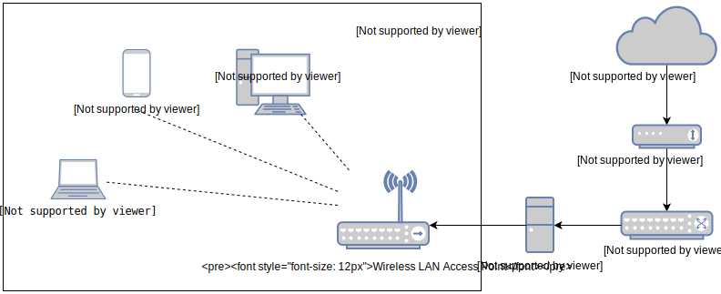

# Captive Portal in Linux

## Description



***Note:** Most of the default settings will be used to obtain a functional portal Captive with the minimum configuration
we will assume most of the default.*

## Requirements

### Hardware
- Internet connection
- Wireless LAN Access Point
- **2 network cards**

### Software
- CentOS 7

## Installation

All the commands listed below will be executed as **root**.

1. Update CentOS 7:
    ```bash
    yum check-update
    yum update
    ```

2. Disable firewall by default:
    ```bash
    systemctl stop firewalld
    systemctl disable firewalld
    ```

3. Install packages and dependencies:
    ```bash
    # Tools
    yum install wget nano
 
    # Firewall
    yum install iptables-services
 
    # FreeRADIUS
    yum install freeradius freeradius-utils
 
    # Web Server
    yum install httpd openssl mod_ssl
 
    # Chillispot dependencies
    yum install glibc-devel.i686 glibc-i686 perl-Digest-MD5
    ```

4. Install Chillispot:
    ```bash
    wget https://raw.githubusercontent.com/zoilomora/captive-portal/master/chillispot-1.1.0.i386.rpm
    rpm -Uvh chillispot-1.1.0.i386.rpm
    ```

5. Edit the file ``/etc/chilli.conf`` and modify the following lines:
    ```apacheconfig
    # DNS
    dns1 8.8.8.8
    dns2 8.8.4.4
 
    # FreeRADIUS
    radiusserver1 127.0.0.1
    radiusserver2 127.0.0.1
    radiussecret secret-password-for-radius
 
    # DHCP
    dhcpif eth1
 
    # Universal access method (UAM)
    uamserver https://192.168.182.1/cgi-bin/hotspotlogin.cgi
    uamhomepage https://192.168.182.1/
    uamsecret secret-password-for-uam
    ```

6. Link dictionary from Chillispot to FreeRADIUS
    ```bash
    echo "\$INCLUDE /usr/share/doc/chillispot-1.1.0/dictionary.chillispot" >> /etc/raddb/dictionary
    ```

7. Copy the login script and grant permissions:
    ```bash
    cd /var/www/cgi-bin/
    cp /usr/share/doc/chillispot-1.1.0/hotspotlogin.cgi ./hotspotlogin.cgi
    chown apache.apache ./hotspotlogin.cgi
    chmod 700 ./hotspotlogin.cgi
    ```

8. Edit the file ``/var/www/cgi-bin/hotspotlogin.cgi``:
    ```php
    # Uncomment the lines
    $uamsecret = "secret-password-for-uam";
    $userpassword = 1;
    ```

9. Create the ``/var/www/html/index.html`` file with the content:
    ```html
    <html>
       <body>
           <a href="http://192.168.182.1:3990/prelogin">Click here to login</a>
       </body>
    </html>
    ```

10. Enable Chillispot firewall rules:
    ```bash
    # Executes iptables rules and is enabled in memory
    /usr/share/doc/chillispot-1.1.0/firewall.iptables
 
    # The rules persist
    service iptables save
    ```

11. Enable IP Forward:
    ```bash
    # Add the line to the end of the file
    echo "net.ipv4.ip_forward = 1" >> /usr/lib/sysctl.d/50-default.conf
 
    # Applies the settings to the system
    /sbin/sysctl -p
    ```

12. Adjust the FreeRADIUS shared secret by editing the file ``/etc/raddb/clients.conf``:
    ```nginx
    client localhost {
        # Replace the default password with that of step 5 (radiussecret)
        secret = secret-password-for-radius
    }
    ```

13. Register user in FreeRADIUS by editing the file ``/etc/raddb/users``:
    ```
    # Insert a line for each user at the end of the file
    john Cleartext-Password := "hello"
    ```

14. Check access to FreeRADIUS from console:
    ```bash
    radtest "john" "hello" 127.0.0.1 0 testing123
    ```

    - Correct result of the command
        ```
        Sent Access-Request Id 215 from 0.0.0.0:51134 to 127.0.0.1:1812 length 75
        	User-Name = "john"
        	User-Password = "hello"
        	NAS-IP-Address = 127.0.0.1
        	NAS-Port = 0
        	Message-Authenticator = 0x00
        	Cleartext-Password = "hello"
        Received Access-Accept Id 215 from 127.0.0.1:1812 to 0.0.0.0:0 length 20
        ```

15. Activate the services so that they start at startup:
    ```bash
    systemctl enable iptables
    systemctl enable httpd
    systemctl enable radiusd
    systemctl enable chilli
    ```

16. Restart the server to apply and activate the services
    ```bash
    reboot
    ```

## Notes

- Start freeradius in debug mode to check in case of error:
    ```bash
    radiusd -X
    ```
